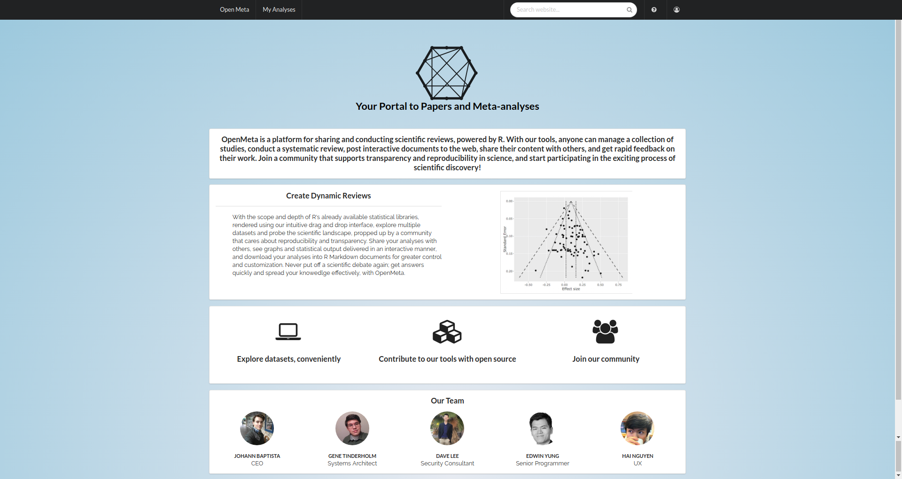
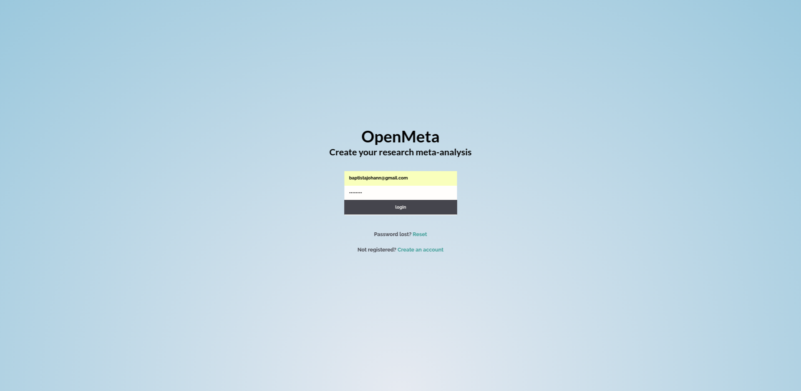
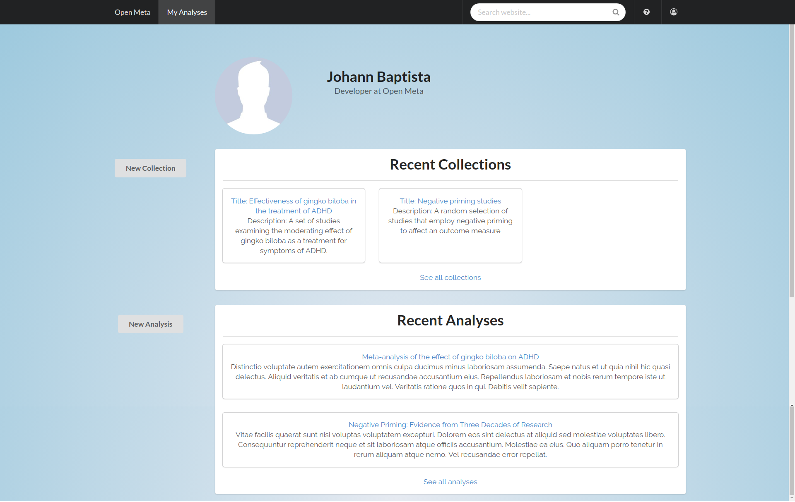
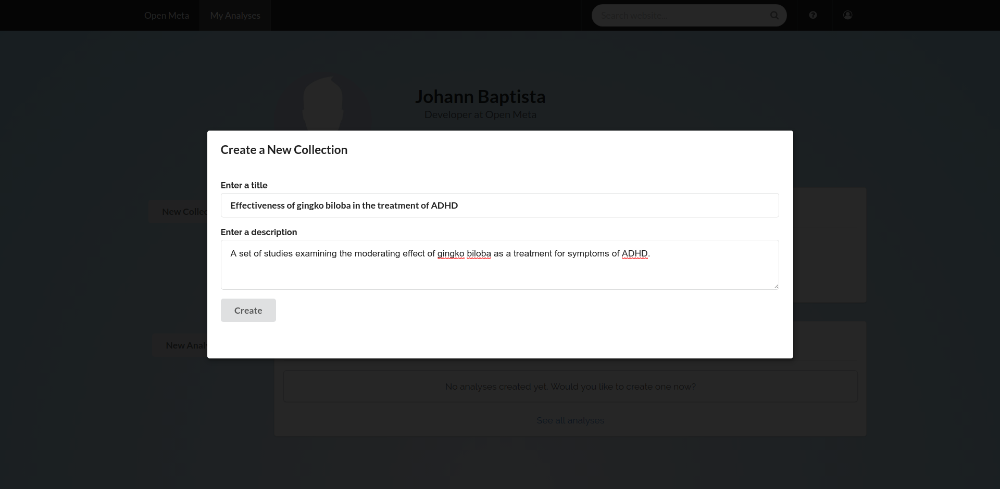
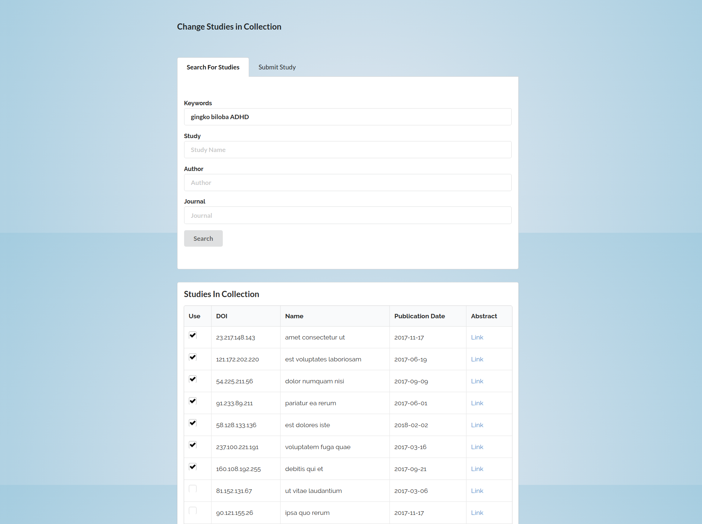
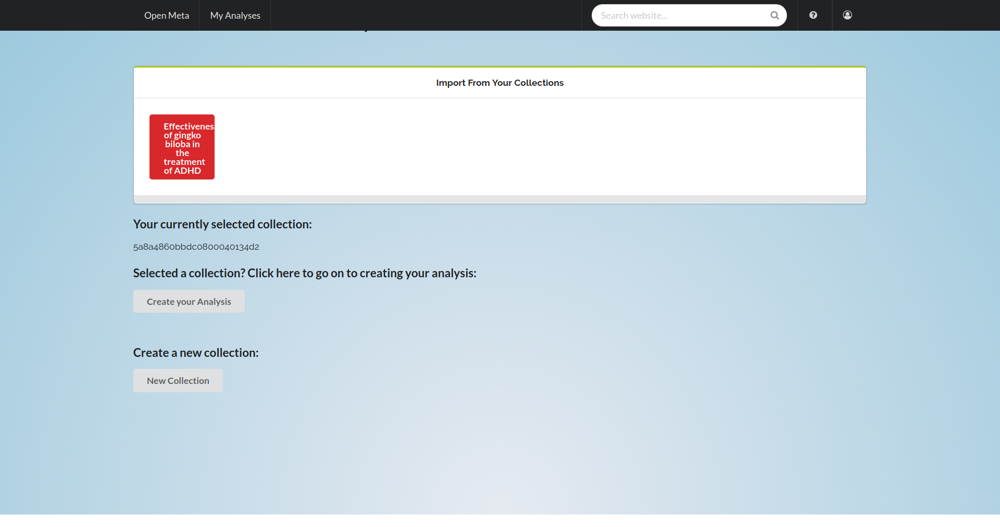

# The Open Meta Project

The Open Meta Project is a website where scientists can conduct, comment on, and share meta-analyses. A meta-analysis asseses the weight of evidence for a research proposition by aggregating the results of a set of studies that address that proposition. It is common in the social, clinical, and pyschological sciences, and is often used to settle important debates. 

With our platform, R's considerable statistical libraries can be harnessed to conduct meta-analyses through an accessible user interface. No coding expertise required. And to expand the project's statistical capabilities (beyond the provided functions), users only need to know R, not JavaScript.

Shareable, reproducible, and interactive scientific analyses---these are the goals of the Open Meta project. For an overview of what has been accomplished, see the "Project showcase" and "Feature list" sections; for a more in-depth explanation of the underlying architercture, see "Rationale and technical concepts".

#### Note: This project is under active development, and documentation is being added every day. The free Heroku dynos that host our back-end also go to sleep after 30 min of inactivity; you may have to wait 20 seconds to log in, on the first access.

## Main technologies

#### JavaScript
* [React](https://reactjs.org/) - Frontend framework
* [Redux](https://redux.js.org/) - State management for complex applications
* [Node.js](https://nodejs.org/en/) - JavaScript runtime
* [Express](https://expressjs.com/) - Server architecture 
* [MongoDB](https://www.mongodb.com/) - NoSQL database
* [Postgres](https://www.postgresql.org/) - SQL database
* [Mongoose](http://mongoosejs.com/) - Object Relational Mapper (ORM) for MongoDB
* [Sequelize](http://mongoosejs.com/) - ORM for SQL
* [Passport](http://www.passportjs.org/) - Authentication
* [Semantic UI](https://react.semantic-ui.com/) - Component library (React version)

#### R
* [OpenCPU](https://www.opencpu.org/) - Web interface to R
* [ggplot2](http://ggplot2.org/) - Premiere graphics library
* [metafor](http://www.metafor-project.org/doku.php) - Meta-analysis
* [Plotly](https://plot.ly/) - Interactive plotting

## Project Showcase

Currently, we stand at five collaborators, two weeks of active development, and over 10,000 lines of original code. Our website allows users to register an account, save and edit collections of studies that address a particular research question, and conduct and edit a simple drag-and-drop analysis with three demonstration modules. This requires a considerable range of features "under the hood", which are detailed in the "Feature list" section. Below, we present a few main views of the program.

On the landing page, users get to see what Open Meta is all about.



An email and password is required. First-time visitors can also register for an account.



Once logged in, the user is taken to the taken to the "My analyses" page, where they can see two things: collections of studies that they put together, which might be used for an analysis, and their analyses. 



From there, they can choose to initiate a new collection, by hitting the "New collection" button. That brings up a modal.



Once they enter the descriptive information for the collection, they are taken to a page where they can search for studies with a combination of keywords, name, journal, or author. If they still don't find the study they're after, they can enter it via the "Submit study" tab.



From the "My analyses" page, they could also choose to start directly, with a new analysis, and they would see an almost identical modal, but afterwards they would be taken to a page that prompts them to either select an existing collection for their analysis or start one from scratch.



We are working on integrating (and the reducing the complexity of) our documentation; to view some of the in-progress user flows in our application, see [this document](https://github.com/memyselfandhai/openMeta/blob/dev/setup_readme.md).

## Rationale and technical concepts

[Meta-analyses](https://en.wikipedia.org/wiki/Meta-analysis) are among the most useful techniques available today for resolving scientific debates, but despite the profusion of tools available for conducting them, the technical simplicity of the analyses themselves, and their essentially *social* nature---in that they evaluate the work of peers and colleagues---there is as yet no central repository where scientists and academics can conduct and share these analyses. Such a repository would provide the basis for improved reprodubility, faster dissemination of research, and rapid feedback, which are the goals of the Open Meta Project.

In order to make the process of conducting a meta-anlaysis interactive and desconstructable, as well as available to non-coders, our website uses R packages, accessible through a simple drag-and-drop interface, as the analytical/graphical units. These R packages are referenced as API calls inside React *modules*---layers of code, accessible through a JavaScript GUI, which control parameters of the analyses (e.g. studies included)---and these API calls are sent to a public server hosted by OpenCPU, on which the R packages are installed. 

In our system, every component of a meta-analysis (the actual effect size and confidence interval calculations, the forest plot, etc) is represented as an instruction to run a single R function, and sends all the data required to run that function with each API call, in accordance with the decisions of the meta-analyst. These conditional calls, made in sequence, fully define a meta-analysis, and every meta-analysis is fully redubile to those calls---therefore we can disassemble the calls into a script, in the form of an R Markdown document (for further customization), or we can simply store them inside JavaScript objects for later dissemination, editing, and retrieval. 

The encapsulation of every meta-analytic procedure as an API call, moreover, allows R-savy contributors to add procedures to our site without knowing any JavaScript. This gives the Open Meta Project considerable opportunity for lateral expansion, through the addition of new R packages, and allows it to rapidly support the newest procedures, making them available to the scientific community as they are developed.

## Feature list
(as of February 16th, 2018)

These are the features that are complete in some form:

* Form pages where new studies can be located, submitted, and/or added to publicly available user "collections"
* Web crawler that indexes terms that identify studies by keywords found in their abstracts (by searching the provided study URLs)
* SQL database for storing meta-analytically useful information about studies, as well as associations and attributes that make studies conveniently searchable (published journal, authors, year, scientific field, etc)
* MongoDB database for storing information pertinent to the actual site function (user profiles, meta-analysis documents, etc)
* Drag-and-drop interface for selecting modules and rendering their computations in an editable document
* Modules that allow for dynamic inclusion/exclusion of studies
* Modules that allow for exploration of rendred plots through `ggplotly` webpages generated by OpenCPU
* Showcase of meta-analysis documents in single-resource pages available publicly
* Profile pages that display a user's `collections` and `analyses`
* A home page that explains OpenMeta's mission and purpose, and invites user participation
* The ability to add an account to OpenMeta and log in
* User flows for creating a new collection or analysis from the "My analyses" page.

Features that are under development:

* Ability to download meta-analyses as R Markdown documents
* Support for multiple effect size measures when conducting standard meta-analytic procedures
* Support for inclusion of non-standard variables in meta-analytic regressions or mixed-effect models
* User dashboard that shows analyses related to user interests, conducted by other users

Features that will be developed in the future:

* Non-graphical modules that allow access to statistical model outputs
* Ability to browse profiles of other users
* Ability to "fork" a user's analysis and edit it
* Support for changing parameters of analyses on another user's page (in non-permanent, exploratory way)
* Support for following other users
* "Activity feed" that allows users to see recent submissions
* Many more features...

Preview [the site](https://www.open-meta-project.surge.sh).

============================ Notes to the developers on this project >>>>>>>>>>>>>>>>>>>>>>>>>>>>>>>>

Note from Gene:

Push to heroku with the following:

    git subtree push --prefix api heroku master

That way it will only send the back end and not the whole thing.

Note from Johann:

.env file at project root now contains environmental property, REACT_APP_HEROKU_URL; set this to the URL
you use to deploy the back-end.

To deploy the front-end, it is now necessary to use "npm run deploy-front-[gene/johann]"

Current URLs:

Front: openmeta.surge.sh (Gene) / open-meta-project.surge.sh (Johann)

Back: openmeta.herokuapp.com (Gene) / open-meta-project.herokuapp.com (Johann)

Note from Steven:

For the authentification to any route
  - add the token from the redux store to props using a container (it is located under the "Token" key in the redux store )
  - make a fetch request and add the token to the request body like so:
    ```
    fetch("http://localhost:8000/api/tokentest", {
      method: "get",
      headers: new Headers({
        "x-access-token": this.props._token
      })
    }).then(data => {
      this.props.history.push("/profile");
    });
    ```
  - now in the route the request will have a decoded object with the email and passHash (check the console for the server for this)
  ^^ that can now be used for any database accessing via req.decoded.email and req.decoded.passHash

  feel free to slack me for any questions on this -> I can also set the authentification up for a route after you set up the route as well
  
============================ Notes to the developers on this project >>>>>>>>>>>>>>>>>>>>>>>>>>>>>>>>
